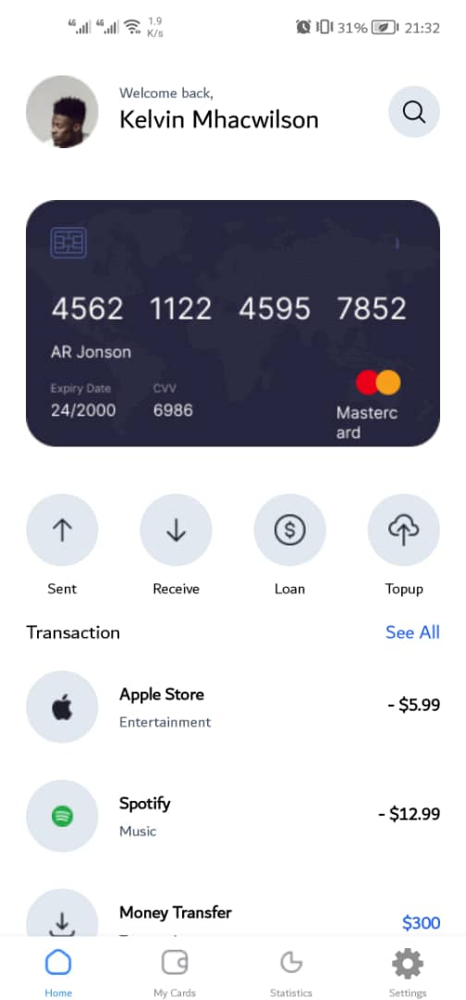

# rn-assignment5-11028723

## Description

This application is designed to help users manage their bank accounts efficiently. The app includes features such as transactions, viewing credit/debit cards , and managing account. It also allows users to switch between light and dark themes to enhance the user experience.
### Components


#### `HomeScreen`
- Displays user information, most used bank card and recent transactions.
- Contains sections to send, recieve, loan and Topup Account.

#### `My Cards`
- Displays All Bank Cards

#### `Statistics`
- Displays all recent transactions, total amount avialable and expenses


#### `Settings`
- Contains sections to change language, edit profile, access contact information, change password and view privacy policy.
- Change App theme

## Student ID

11028723

## Screenshot



## Instructions to Run the Project

1. Clone the repository:

   ```bash
   git clone https://github.com/KelvinLinnaeus/rn-assignment5-11028723.git
   cd rn-assignment5-11028723
   ```

2. Install the dependencies:

   ```bash
   npm install
   ```

3. Start the Expo development server:

   ```bash
   npx expo start
   ```

4. Use the Expo Go app on your mobile device or an emulator to view the application.
